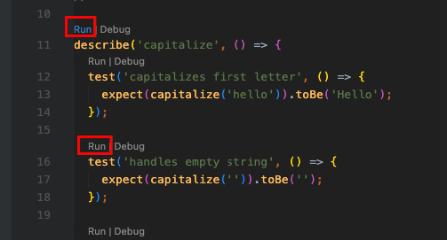

# Testing with Jest + TypeScript

## Why tests?

- **Confidence** — changes don't break existing functionality
- **Documentation** — tests show how the code is supposed to behave
- **Design signal** — if a test is hard to write, the code is too complex (refactor signal)
- **Fast feedback** — bugs are caught immediately, not at deploy time

## Types of tests

```
                 ▲ Slow / Expensive
                 │
    E2E Tests    │  ← real browser, real DB (Playwright, Cypress)
                 │
Integration Tests│  ← multiple units together, real dependencies
                 │
   Unit Tests    │  ← 1 function/class, all dependencies mocked
                 │
                 ▼ Fast / Cheap
```

**Jest** is the framework for Unit and Integration tests.

## Coverage

Coverage shows what % of your code is executed during tests:

| Metric         | What it measures                            |
| -------------- | ------------------------------------------- |
| **Statements** | % of code statements executed               |
| **Branches**   | % of conditions (`if/else`, `?:`) covered   |
| **Functions**  | % of functions called                       |
| **Lines**      | % of lines executed (similar to statements) |

### Running coverage

```bash
# Text report in terminal
npx jest --coverage

# Specific folder only
npx jest src/03-tests --coverage

# Open HTML report in browser (after running --coverage)
open coverage/index.html         # macOS
start coverage/index.html        # Windows
```

### Reading the HTML report

After `npm jest --coverage`, open `coverage/index.html`:

- **Green** — covered lines
- **Red** — never executed (missing test)
- **Yellow** — branch not fully covered (e.g. only `if`, never `else`)

Click into any file to see exactly which lines are uncovered.

### What counts as "good" coverage

100% coverage ≠ bug-free code. Tests can cover a line without testing edge cases.

| Coverage | Signal                                   |
| -------- | ---------------------------------------- |
| > 80%    | Healthy                                  |
| 50–80%   | Acceptable, but look for gaps            |
| < 50%    | High risk — add tests for critical paths |

The `collectCoverageFrom` in `jest.config.js` defines which files are included
in the report (only `exercises/` and `src/03-tests/` source files, not examples or tests themselves).

## Section structure

| Folder            | Topic                                                    |
| ----------------- | -------------------------------------------------------- |
| `01-matchers/`    | toBe, toEqual, toThrow, toContain and other matchers     |
| `02-spies-mocks/` | jest.fn(), spyOn(), toHaveBeenCalledWith(), mock cleanup |
| `03-lifecycle/`   | beforeEach, afterEach, beforeAll, afterAll               |
| `04-async/`       | Testing async/await, fake timers                         |
| `05-snapshots/`   | Snapshots: when and why                                  |
| `06-tdd/`         | TDD: Red → Green → Refactor                              |

## Running tests

### Extension(jest)



### CLI

```bash
# All tests
npx jest

# Specific folder
npx jest src/03-tests/01-matchers

# Watch mode (auto-restart on file change)
npx jest src/03-tests/01-matchers --watch

# With coverage
npx jest src/03-tests --coverage
```

### VS Code Extension — Jest Runner (recommended for learning)

- Install: **"Jest Runner"** (`firsttris.vscode-jest-runner`)
- `▶ Run | Debug` buttons appear above each `test()` / `it()`
- Click → runs only **that test**, not all of them

### VS Code Extension — Jest (official, for daily work)

- Install: **"Jest"** (`Orta.vscode-jest`)
- Auto-runs tests when a file changes
- 🟢 / 🔴 indicators directly in editor lines
- Sidebar with the full test tree

## jest.config.js — key options explained

The config lives at `jest.config.js` in the project root.

```js
// Where Jest looks for tests
testMatch: ['<rootDir>/src/**/__tests__/**/*.test.{js,ts}']

// Run .ts files through ts-jest, .js through babel-jest
transform: { '^.+\\.ts$': 'ts-jest', '^.+\\.js$': 'babel-jest' }

// Run tests in different environments (node vs browser)
projects: [
  { displayName: 'node', testEnvironment: 'node', testMatch: [...] },
  { displayName: 'jsdom', testEnvironment: 'jsdom', testMatch: [...] },  // React tests
]

// Which source files appear in the coverage report
collectCoverageFrom: ['src/**/exercises/**/*.ts', ...]

// Where to save the HTML/lcov report
coverageDirectory: 'coverage'

// Reset mock.calls and mock.results before every test
// Does NOT reset mockReturnValueOnce queue — use resetMocks for that
clearMocks: true

// resetMocks: true   → also clears mock implementation + return queue
// restoreMocks: true → additionally restores jest.spyOn() originals
```

### Mock cleanup options compared

| Option         | Clears calls | Clears implementation | Restores spyOn |
| -------------- | ------------ | --------------------- | -------------- |
| `clearMocks`   | ✅           | ❌                    | ❌             |
| `resetMocks`   | ✅           | ✅                    | ❌             |
| `restoreMocks` | ✅           | ✅                    | ✅             |

This project uses `clearMocks: true`. If you need full reset per test, recreate mocks in `beforeEach`.

## Naming conventions

```typescript
// One describe = one module/class
describe('Calculator', () => {

  // One test/it = one behavior
  it('returns sum of two numbers', () => { ... });
  it('throws when dividing by zero', () => { ... });

  // test() and it() are identical
  test('returns 0 for empty array', () => { ... });
});
```

**AAA rule (Arrange → Act → Assert):**

```typescript
it('filters active users', () => {
  // Arrange
  const users = [{ active: true }, { active: false }];

  // Act
  const result = filterActive(users);

  // Assert
  expect(result).toHaveLength(1);
});
```
